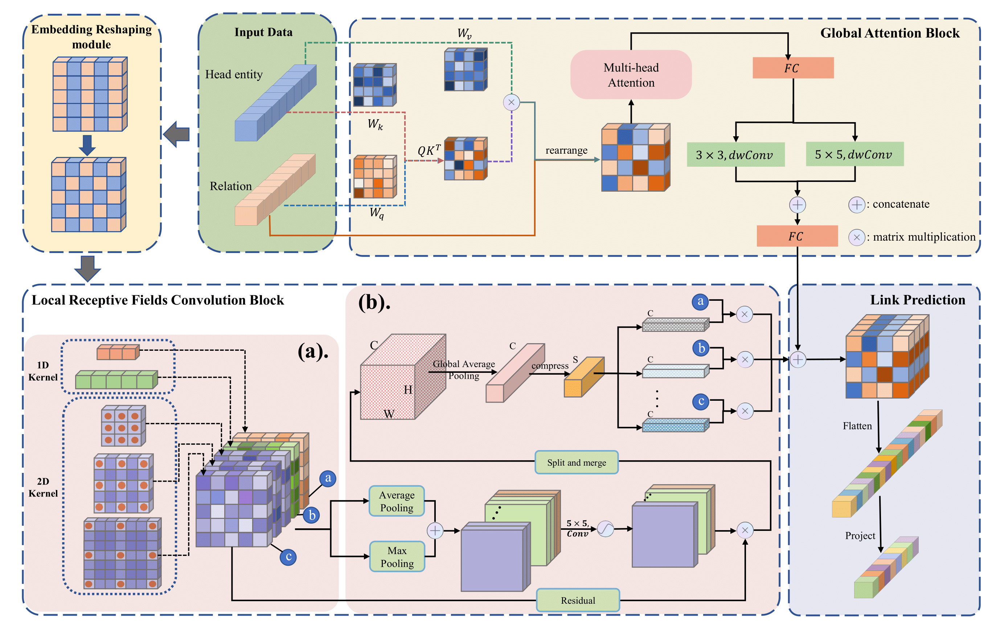

# Attention Enhanced Knowledge Graph Embeddings with Variable Receptive Fields for Link Prediction
<a href=''></a> 
 

The implementation of our work "Attention Enhanced Knowledge Graph Embeddings with Variable Receptive Fields for Link Prediction".

## :golf: Structure


## :running: Running:
### Dependencies

```
python==3.8
numpy==1.21.5
scikit-learn==1.0.2
scipy==1.7.3
torch==1.12.1
tqdm
```

### :flags: Datasets

We conduct experiments on 7 datasets:

| Datasets        | Entities | Relations | Train     | Valid  | Test   |
|-----------------|----------|-----------|-----------|--------|--------|
| WN18RR          | 40,943   | 11        | 86,835    | 3,034  | 3,134  |
| FB15k-237       | 14,541   | 237       | 272,115   | 17,535 | 20,466 |
| WN18            | 40,943   | 18        | 141,442   | 5,000  | 5,000  |
| FB15k           | 14,951   | 1345      | 483,142   | 50,000 | 59,071 |
| KINSHIP         | 104      | 25        | 8,544     | 1,068  | 1,074  |
| YAGO3-10        | 123,182  | 37        | 1,079,040 | 5,000  | 5,000  |

## :balloon: Training AVFE
Take WN18RR as a example:
```
python main.py --data_path "./data" --run_folder "./" --data_name "WN18RR" --embedding_dim 200 --filter1_size 1 3 --filter2_size 3 3 --filter3_size 1 5 --output_channel 5 --min_lr 0.001 --batch_size 1024 --log_epoch 2 --neg_ratio 1 --input_drop 0.2 --hidden_drop 0.1 --feature_map_drop 0.1 --opt "Adam" --learning_rate 0.001 --weight_decay 5e-4 --factor 0.5 --verbose 1 --patience 5 --max_mrr 0 --epoch 600 --momentum 0.9 --save_name "./model/wn18rr
```


